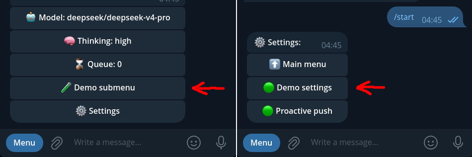

# pi-telegram-extension-demo



**Reference implementation of a third-party extension for `pi-telegram`.**

This extension proves that ordinary pi extensions can add interactive buttons to the Telegram bot interface — main menu rows, Settings submenu toggles, and inline views — without owning a second bot poller, forking transport, or touching `pi-telegram` internals.

Import `registerTelegramSection` from `@llblab/pi-telegram/sections`, define a section with `render`, `handleCallback`, and optional `settings`, and the bridge handles polling, callback routing, navigation hierarchy, authorization, and diagnostics.

## Install

From npm:

```bash
pi install npm:@llblab/pi-telegram-extension-demo
```

From git:

```bash
pi install git:github.com/llblab/pi-telegram-extension-demo
```

Requires `@llblab/pi-telegram` ^0.12.0 (which provides the Extension Sections platform public API).

## What it registers

Two UI surfaces through `pi-telegram`'s Extension Sections platform:

- **Main menu** — `🧪 Demo submenu` row before ⚙️ Settings. Opens an interactive panel with enqueue-prompt, answer-callback, info popup, a live counter, and a confirmation dialog (`💬 Confirm dialog`) that sends buttons into chat, deletes itself on answer, and posts a follow-up message.
- **Settings submenu** — `🧪 Demo settings` row with a dynamic ON/OFF status indicator (`🟢`/`⚫️`). Opens a toggle panel where clicking ON/OFF re-renders the view and updates the indicator in the Settings list.

Every button click produces an unambiguous result: a queued prompt, a native Telegram popup, or a message edit. Navigation hierarchy (Back → parent, Main menu → root) is preserved automatically by the platform.

## How it works

```ts
import type { ExtensionAPI } from "@earendil-works/pi-coding-agent";
import { registerTelegramSection } from "@llblab/pi-telegram/sections";

export default function (pi: ExtensionAPI) {
  const unregister = registerTelegramSection({
    id: "@llblab/pi-telegram-extension-demo",
    label: "🧪 Demo submenu",
    render: async (ctx) => ({
      text: "<b>Demo</b>",
      replyMarkup: {
        inline_keyboard: [
          [{ text: "Click me", callback_data: ctx.callbackData("act") }],
        ],
      },
    }),
    handleCallback: async (ctx) => {
      await ctx.answerCallback(`action: ${ctx.action}`);
      return "handled";
    },
  });
  pi.on("session_shutdown", () => unregister());
}
```

1. `registerTelegramSection()` adds a row to the main menu and registers callback handlers
2. `ctx.callbackData()` builds a namespaced callback string — never hand-roll `section:` tokens
3. `ctx.edit()`, `ctx.open()`, `ctx.enqueuePrompt()`, `ctx.answerCallback()` are the only surface area
4. The bridge owns: polling, Telegram API, menu rendering, callback routing, navigation, stale-token answers
5. `pi.on("shutdown", ...)` cleans up on unload

## Dependencies

- `@llblab/pi-telegram` ^0.12.0 (peer) — provides `registerTelegramSection` and the shared Telegram shell
- `@earendil-works/pi-coding-agent` (peer) — provides `ExtensionAPI` types

## Reference

- [Extension Sections Standard](https://github.com/llblab/pi-telegram/blob/main/docs/sections.md) — full contract, context ports, navigation rules, Telegram Bot API integration
- [pi-telegram](https://github.com/llblab/pi-telegram) — the Telegram runtime adapter for π
- [Callback Namespaces](https://github.com/llblab/pi-telegram/blob/main/docs/callback-namespaces.md) — shared callback ownership rules

## License

MIT
